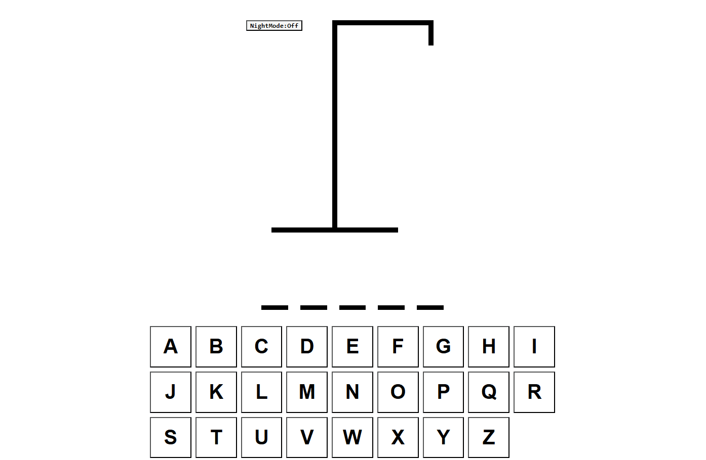

# 🪓 Redux Hangman : React + Redux Toolkit + Vite

> 🎯 Classic Hangman game built with React and enhanced using Redux Toolkit for state management and a  
> Dark Mode toggle.  
<br>
> (ES) Versión moderna del clásico juego del Ahorcado, construida con React y potenciada con Redux Toolkit y modo oscuro.

<br>

## 📌 Description / Descripción

**EN**  
This project is a modern implementation of the Hangman game. It was originally based on a [Web Dev Simplified](https://www.youtube.com/@WebDevSimplified) tutorial (React only), but extended with Redux Toolkit for state management and a dark mode theme toggle. The application features both mouse and physical keyboard support. The game uses a local JSON word list and renders parts of a drawing as the player makes mistakes.

**ES**  
Este proyecto es una implementación moderna del clásico juego del Ahorcado. Se basa originalmente en un tutorial de [Web Dev Simplified](https://www.youtube.com/@WebDevSimplified) (solo React), pero fue extendido con Redux Toolkit para el manejo de estado, y se agregó un modo oscuro como mejora visual. La aplicación se puede jugar tanto con el mouse como con el teclado físico. Utiliza una lista de palabras en un archivo JSON y va dibujando partes del muñeco a medida que el jugador se equivoca.

<br>

> 📝 The game is in English.  
> 📝 El juego está en inglés.

<br>

## 🎥 Demo

### 💡 Gameplay  


<br>

### 🌙 Dark Mode  


<br>

- You can try this game live [here.](https://codenamecoffee.github.io/ReduxHangman/)
- Puedes probar el juego en vivo [aquí.](https://codenamecoffee.github.io/ReduxHangman/)

<br>

## ⚙️ How to Run / Cómo ejecutar

### With Yarn:

```bash

yarn
yarn run dev

```

### With NPM:

```bash

npm install
npm run dev

```

<br>

> Then open your browser and visit the local server URL provided in the terminal (usually http://localhost:5173).

<br>

## 🚀 Technologies Used / Tecnologías utilizadas

* React

* Redux Toolkit

* React Redux

* Vite

* JavaScript

* CSS

<br>

## 🧠 Potential Improvements / Posibles mejoras

* Add sound effects for correct/wrong guesses

* Show a scoreboard or player streaks

* Add difficulty levels (easy, medium, hard)

* Load words dynamically from an API

* Translate UI to support multiple languages

* Use React Router for different screens or game modes

<br>

## 📚 Credits / Créditos

* Original idea based on Web Dev Simplified (React only version)

* Redux Toolkit integration and Dark Mode by Federico González Lage

<br>

✍️ Created by Federico González Lage - 2024
